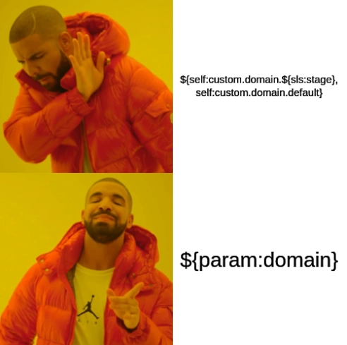

If you haven't read about the release and what's included in this update, I highly recommend you read both the [beta release announcement](https://www.serverless.com/blog/serverless-framework-v3-beta) and the [full release announcement](https://www.serverless.com/blog/serverless-framework-v3-is-live) first as they give a good overview of all the changes. In this post, I'll highlight a few of those core changes and their significance.

## Upgrading from v2 to v3

The Serverless Framework team did an amazing job of making the migration to v3 as seamless as possible without major breaking changes and kept up their habit of making things backwards compatibility. The upgrade is as easy as follows:

1. Upgrade to the latest version of v2. If you're on v1, you'll have a bit more work to do.
2. Check if you have _any_ deprecation notices.
   - If yes, you'll want to fix those but the good news is they should all be restricted to your `serverless.yaml` files.
   - Some deprecations may be related to your plugins. The Serverless Framework team worked with many of the most popular plugins to make them backwards compatible. Go read your plugins' documentation and make the needed upgrades.
3. Upgrade serverless to v3. Typically you can just do this on your system with the following:

   ```shell
   npm i -g serverless
   ```

4. Now, you can update your `serverless.yaml` to specify the new version.

   ```yaml
   service: <your service name here>
   plugins:
     - <your plugins here>

   frameworkVersion: '3' # This is the line to change from 2 -> 3
   ```

   If you find issues when you move to v3, you can easily just flip this back to v2 so you should definitely give this a shot.

## 🎉 New Stage Parameters 🎉

TL;DR:


This is by far my favorite feature included with this update as it removes an old hack that many serverless developers implemented to achieve the end goal of this feature. Specifically, this feature allows you to set service configuration settings based on the current stage, or environment. This is incredibily important for larger teams implementing serverless applications as typically, you'll have a production, staging, and/or development environment that may need custom configuration.

Before, you might have setup your `serverless.yaml` like this:

```yaml
# ...

custom:
  profile: my-profile

  stage_env:
    dev:
      PROFILE: dev
      SLS_STAGE: dev

    local:
      PROFILE: dev
      SLS_STAGE: local

provider:
  name: aws
  stage: ${opt:stage, "local"}
  region: ${opt:region, "us-east-1"}
  runtime: nodejs14.x
  profile: ${self:custom.profile}-${self:custom.stage_env.${self:provider.stage}.PROFILE, 'dev'}
# ...
```

Notice the really hard to grok field, `profile`, under `provider`. This was what we had to do to configure our service variables per development stage. For example, if I want the dev environment setup, I would set `--stage local` when I run my serverless commands and `profile` would be set to `my-profile-dev`. This is pretty hard to keep track of and lead to many long configuration debugging sessions.

Now, you can use the new stage parameters by setting their values under the `params` key and then acessing them via the `${param:xxx}` syntax. So our above `serverless.yaml` can now be rewritten as:

```yaml
# ...
params:
  dev:
    PROFILE: my-profile-dev
    SLS_STAGE: dev
  local:
    PROFILE: my-profile-dev
    SLS_STAGE: local

provider:
  name: aws
  stage: ${opt:stage, "local"}
  region: ${opt:region, "us-east-1"}
  runtime: nodejs14.x
  profile: ${params:PROFILE}
# ...
```

## Improved CLI

I refer you to the [full release post from the Serverless team](https://www.serverless.com/blog/serverless-framework-v3-is-live) to really see these highlights as they did a wonderful job showing you the before and after of the enhancements. I'll give my quick opinion here on these improvements:

- The CLI now only informs you of what you need to know. Before, there was a little extra white noise which _could_ be helpful under the right circumstances but was mostly unhelpful. Now, it tells you the facts you care about: (1) where was my app deployed and (2) what endpoints can I use to access it.
- The `--verbose` flag now provides all that additional information that's now hidden when you need to debug and provides it in a much more readable format.
- Errors now look like errors! 🛑 Before, errors looked like the rest of the output returned by a command so it didn't immediately capture your eye. Now, it's very obvious when a problem occurs with seemingly better messaging. I haven't had too many run ins with this experience yet as the rest of my systems have upgraded so cleanly but the few times I've seen an issue, it took me seconds to realize what the problem was instead of minutes.

If you're new to Serverless Framework, trust me when I say that the devs really thought about you with these updates. These were real problems for folks and now, they're a thing of the past. There's always room to improve so if you see something that could be better, let them know as they're clearly listening to their users. 🥰

## Onboarding

One of my least favorite things with the old CLI was starting a new project. Previously, it created your new project in your current work directory so I would accidentally clutter my top-level `development` folder that I keep and would have to manually clean things up. Additionally, the setup only gave you the minimum files and setup needed to start so the README.md, serverless.yaml, and handler.js.

The new CLI project starter made a ton of improvements. Now, it creates the new folder for your project and initializes all your files in there. The CLI offers you a set of standard templates for common usages and guides you to their full list of amazing starter kits for new projects.


They kept with the old and help you quickly configure your project for the Serverless Dashboard and help you do your first deploy on project init but allow you to opt out as well.

## Plugins

As I mentioned earlier, the Serverless team did a great job helping the community migrate popular plugins to be v3 compatible. I've never created a plugin myself, but the team has put out some great resources and new plugin API for those looking to create their own tooling for Serverless Framework. I've gone ahead and experimented with the following plugins and can say they have played really nicely with v3:

- [Serverless Offline](https://www.npmjs.com/package/serverless-offline)
- [Serverless Webpack](https://www.npmjs.com/package/serverless-webpack)
- [Serverless ESBuild](https://www.npmjs.com/package/serverless-esbuild)
- [Serverless Bundle](https://www.npmjs.com/package/serverless-bundle)
- [Serverless S3 Remover](https://www.npmjs.com/package/serverless-s3-remover)
- [Serverless DynamoDB Local](https://www.npmjs.com/package/serverless-dynamodb-local)

This isn't to say they've all been officially upgraded to the latest plugin API and play nice with the new CLI, but they still work so if you're in need of any of these plugins, I'd say they're safe to use but are worth your own investigation. 😉

## Conclusion

Serverless Framework continues to be my favorite toolchain for building applications utilizing serverless architectures, and I'm really excited to see the developers continue to improve it in meaningful ways. The other changes I haven't covered here are some specific deprecated syntaxes that I think are uncommon. If you need more info on them though, [read the upgrade guide](https://www.serverless.com/framework/docs/guides/upgrading-v3).

I want to send a special thank you to the Serverless Framework team for their hard work and making this great tool even better! You all hit a homerun with this one! 🎉
